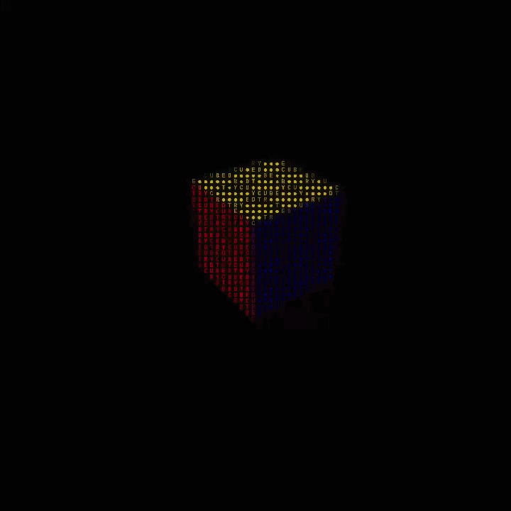

# What is *cubed*?
Cubed is a lightweight rendering of a 3x3 cube in HTML. 
## Features
- **spin speed**: watch the cube dance around in a mesmerizing motion.
- **turn a layer**: scramble the cube, solve it, or even create a simple pattern.
## Setup
```bash
git clone https://github.com/mplshassan/cubed
cd cubed
open index.html
```
## Example 

## Credits
Built by Mustafa Hassan
